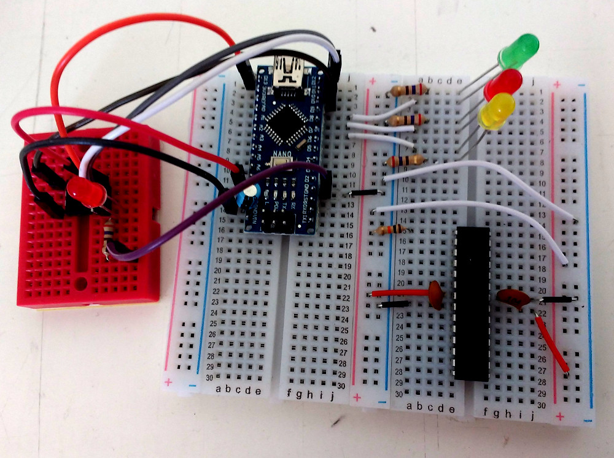

# AVR-Experiments
This repository consists of small single AVR microcontroller coding examples. 

### 1. Blink
---
Small programm that was used to test if the Arduino Nano ISP programmer and the Makefile worked.

## License
---
Distributed under the MIT License.

## References
---
* [Make: AVR Programming by Elliot Williams](https://www.safaribooksonline.com/library/view/make-avr-programming/9781449356484/)
* [Arduino as In-circuit Serial Programmer (ISP)](https://www.arduino.cc/en/Tutorial/ArduinoISP)

## Authors:
---
* quirxi (https://github.com/quirxi)
